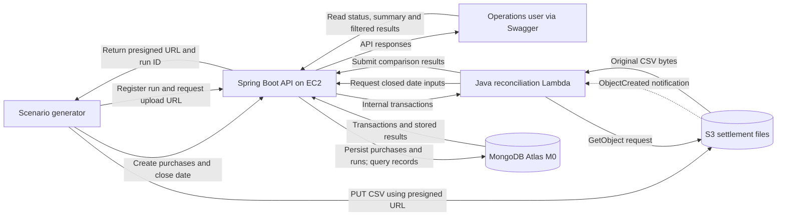

# Payment Reconciliation Platform MVP Specification

Status: Draft for review. Version: 0.1. Date: 2026-10-01.

This specification consolidates the agreed scope for a one-week personal project demonstrating AWS and MongoDB through simulated payment reconciliation. It defines behavior, component responsibilities, contracts, and acceptance criteria. It is the proposed implementation baseline; the application remains a Spring Initializr starter until the written specification is reviewed.

## Purpose and business context

A processor's internal purchase records may disagree with a later external settlement file. The platform compares the two datasets, classifies discrepancies, and exposes evidence through an API. It models an acquiring-side reconciliation control, without claiming to reproduce Payway's architecture.

Success is a repeatable demonstration that records purchases, closes a business date, uploads a settlement file, processes it through AWS Lambda, and displays correct results through Swagger. The developer should be able to explain compute choices, database modeling, indexing, retry behavior, and the limitations of the simplified domain.

## Agreed scope and proposed defaults

The conversation established these requirements:

- Java 21 and Spring Boot on EC2; MongoDB Atlas is the operational datastore.
- Lambda performs file validation and reconciliation. It accesses MongoDB through Spring's API.
- S3 stores original settlement files and directly triggers Lambda; no application SQS queue is required.
- Each settlement file is complete for one business date N and arrives on N+1 or later.
- Internal purchases are already captured, immutable after their date is closed, and identified by a globally unique reference shared with settlement.
- ARS is the only currency. Amounts use integer centavos.
- The five outcomes are matched, missing in settlement, missing internally, amount mismatch, and duplicate settlement reference.
- API-only interaction through Swagger; detection and display, with no investigation or resolution workflow.
- An automated generator produces purchases, settlement files, and expected outcomes.
- Initial bounds: 1,000 internal purchases per business date, 2,000 settlement data rows, and a 2 MiB CSV.
- Terraform makes AWS infrastructure reproducible. A new AWS Free account plan and Atlas M0 support a zero-out-of-pocket demo, subject to account eligibility and available benefits.
- A presigned upload flow, as illustrated in the supplied diagram, is included.

The following details are proposed defaults introduced to make the spec implementable, and should be reviewed with the rest of this document: explicit date-close operation; timezone America/Buenos_Aires; CSV schema; REST paths; run identity based on content checksum and rule version; embedded results in each run document; access through an SSH tunnel; and manual recovery of interrupted runs. They refine the agreed design and do not represent existing code.

Out of scope: real card data or money movement, card-network connections, authorization/capture workflows, refunds, reversals, disputes, FX, fees and taxes, partial-file merging, delayed-settlement rules, a custom frontend, automatic transaction archiving, S3 transaction snapshots, automatic remediation, high availability, and production compliance.

## Architecture and diagram interpretation

The supplied diagram is correct as a logical request-flow diagram. Its Lambda-to-S3 arrow represents a download request; the file content flows back in the response. The Lambda-to-Spring retrieval arrow similarly represents a request, not transaction data flowing toward Spring. Add Spring's database read and the operations user's result queries. The external actor and POS are simulated by the generator.

The following diagram shows requests and their relevant responses explicitly:



Spring owns purchase ingestion, business dates, database access, upload registration, persistence, and result queries. Lambda owns CSV parsing, validation, duplicate grouping, comparison, and generation of the structured comparison report. Lambda has no MongoDB credentials. Its comparison core must also run locally without AWS.

S3 retains original files. The report is structured JSON persisted through Spring in MongoDB; a separate S3 report export is not required. MongoDB remains authoritative for internal purchases and published results.

The selected split is suitable for a small event-triggered batch and demonstrates two compute models. An EC2 background worker could do the same comparison with fewer network dependencies. Lambda is a deliberate learning choice, not an assumption that it is necessary or always cheaper. S3 snapshots would reduce dependence on API availability and preserve extracted inputs, but the closed-date rule makes them unnecessary for this MVP.

## Business date and transaction invariants

**REQ-01 Purchase ingestion.** A purchase has transactionReference, merchantId, businessDate, amountCentavos, currency, and server-recorded receivedAt. businessDate is an explicit ISO date in this simulation. Currency must be ARS and amountCentavos a positive signed 64-bit integer; fractional JSON numbers and floating-point storage are rejected. No raw card identifiers are accepted.

References are case-sensitive strings of 1 to 64 ASCII letters, digits, underscores, or hyphens. merchantId is a nonempty string of at most 64 characters. A reference is globally unique across business dates. An exact repeat of a purchase creation request returns the existing purchase; a repeat with different business fields returns conflict.

**REQ-02 Date closure.** A business date moves from OPEN to CLOSED exactly once; closing it again is harmless. It cannot be reopened in this version. Purchases cannot be added to a closed date and purchase modification/deletion endpoints do not exist. The 1,000-purchase limit must hold under concurrent requests.

Closing a date and inserting a purchase must coordinate through the same business-date guard: if insertion wins, the closed dataset includes it; if closing wins, insertion fails. A check of OPEN followed by an unrelated insert is insufficient. With separate date and transaction documents, ingestion must update the date guard and insert the purchase in one MongoDB transaction; closing updates that same guard. Handle transaction write conflicts with bounded retries and recheck the state.

**REQ-03 Stable inputs.** All runs for a closed date use the same full internal dataset, including purchases whose references are absent from settlement. Fetching only references seen in the file is prohibited. An empty date may be explicitly created and closed.

Date validation uses America/Buenos_Aires and a controllable application clock. Upload registration requires a CLOSED date strictly earlier than the current business date. Arrival date does not determine which purchases are reconciled. A persisted close timestamp and purchase count explain the dataset's boundary.

## Settlement file contract

**REQ-04 CSV format.** A UTF-8 CSV has exactly these columns, in this order:

```csv
business_date,transaction_reference,amount_centavos,currency
2026-09-29,MATCH-001,12345,ARS
2026-09-29,AMOUNT-001,9999,ARS
```

Use a CSV parser with quoted-field support; accept LF and CRLF. The header is mandatory. Every data row must have four fields, match the registered date, satisfy the reference and positive-integer rules, and use ARS. No whitespace trimming or case normalization may silently change financial input. A header-only file is valid and represents zero external transactions for the registered date. An empty file without a header is invalid. No trailing extra fields or malformed records are accepted.

Duplicate references are valid input evidence, not a CSV validation error. Preserve each data row's 1-based row number, reference, and amount. Row number 1 means the first record after the header, independent of newline characters inside quoted fields. Any invalid record fails the entire file; no partial comparison results are published.

The raw byte size must be at most 2,097,152 bytes and data-row count at most 2,000. Validate declared size at registration, actual object size before downloading, and bytes/rows while parsing. Upload permissions do not replace application validation.

## Comparison rules and report

**REQ-05 Classification.** Group settlement rows by reference and evaluate the union of internal and external references in this precedence:

| Condition | Outcome |
| --- | --- |
| Two or more settlement rows have the reference | DUPLICATE |
| Exactly one settlement row, no internal purchase | MISSING_INTERNALLY |
| Internal purchase, no settlement row | MISSING_IN_SETTLEMENT |
| One record on each side, unequal amountCentavos | AMOUNT_MISMATCH |
| One record on each side, equal amountCentavos | MATCHED |

Duplicate precedence applies even if the reference is unknown internally or repeated rows have different amounts. One outcome is produced per distinct logical reference. API ingestion prevents duplicate internal references, so this version detects duplicates in settlement only.

A result includes reference, outcome, optional internal amount, settlement evidence with row numbers and amounts, and internal merchantId when known. Evidence retains every duplicate row. Deterministic ordering by reference makes tests and report comparisons stable.

**REQ-06 Summary.** Report internal purchase count, settlement row count, distinct settlement reference count, total result count, and count for each outcome. Outcome counts sum to total result count, not necessarily to settlement row count. A run containing discrepancies is COMPLETED; discrepancies are business outcomes, not infrastructure failures.

## Upload registration and file identity

**REQ-07 Registered uploads.** The client computes the CSV's SHA-256, submits its business date, checksum, and byte length to Spring, and receives runId, object key, required headers, expiration, and a presigned PUT URL. Spring persists the run before returning the URL.

Use one simulated settlement source. The logical run identity is (source, businessDate, SHA-256 of exact file bytes, rulesVersion). A repeated registration of this identity returns the same run. Different bytes constitute a new run and never replace old results, allowing corrected synthetic files without partial merging or automatic supersession.

Use an object key such as settlements/{businessDate}/{runId}.csv. The proposed URL lifetime is ten minutes or less if its signing credentials expire sooner. Sign the upload checksum header and return it to the client. Original bytes and their checksum are authoritative; do not treat an S3 ETag as a universally valid content hash.

Enable bucket versioning and bind a run to the first validated object version. Read that exact version when processing or replaying. Reuse of a still-valid presigned URL must not change the run's bound input. Validate actual bytes against the registered checksum; a different payload fails, regardless of its filename.

The generator performs the direct S3 PUT. Swagger documents URL registration and result queries; it does not need to act as an S3 upload UI. A completed run does not receive another upload URL. An unuploaded registration is visible as AWAITING_UPLOAD; it is not reported as reconciled.

## API contract

**REQ-08 Public demo API.** The proposed routes are:

| Method and route | Behavior |
| --- | --- |
| POST /api/v1/business-dates | Create an OPEN date, including an empty date |
| POST /api/v1/transactions | Create or safely repeat a simulated purchase |
| POST /api/v1/business-dates/{date}/close | Close the date idempotently |
| POST /api/v1/reconciliation-runs | Register file identity and return upload instructions |
| GET /api/v1/reconciliation-runs?businessDate={date} | List runs with last-known status |
| GET /api/v1/reconciliation-runs/{runId} | Return status, input identity, errors and summary |
| GET /api/v1/reconciliation-runs/{runId}/results?outcome={outcome}&page=0&size=50 | Return deterministic paginated results, optionally filtered |
| POST /api/v1/reconciliation-runs/{runId}/reprocess | Request recovery using the retained original file |

Input validation returns 400, unknown resources 404, closed-date or conflicting-identity operations 409, unsupported body media types 415, and oversized application payloads 413. New purchases and runs return 201; harmless repeats return 200. Reprocess returns 202 when invocation is accepted, not when processing completes. Results before completion return 409 and no partial results. Pagination caps size at 100. Errors have a stable code, message, correlationId, and optional field errors without credentials or stack traces.

Swagger/OpenAPI documents request and response schemas, integer units, statuses, filters, and representative errors. Internal worker operations must not be exposed in the user-facing Swagger document.

**REQ-09 Worker API.** Private authenticated operations allow Lambda to obtain registered run metadata, bind the exact object version, mark an attempt as processing, fetch all closed-date purchases, submit the complete report, and record a failure when Spring is reachable. Proposed paths use /internal/v1/reconciliation-runs/{runId} with /input, /processing, /results, and /failure operations. Input includes date, rule version, expected checksum, and purchases. Processing receives bucket, key, versionId and verified checksum; results reference that same identity.

These are task-specific contracts, not arbitrary MongoDB query forwarding. Treat the result submission as a full idempotent PUT. Spring validates result schema, bounds, registered identity, duplicate result references, required evidence, and summary consistency before publication. The comparator remains responsible for calculating classifications.

## MongoDB model and consistency

**REQ-10 Persistence.** Proposed collections are:

| Collection | Contents and indexes |
| --- | --- |
| transactions | Immutable purchase documents; unique transactionReference; index on businessDate and transactionReference |
| businessDays | One document per businessDate, OPEN/CLOSED state, count and close timestamp; unique businessDate |
| reconciliationRuns | Registered source/date/checksum/rulesVersion, S3 version identity, timestamps, status, error, summary and embedded result array; unique logical run identity; index on businessDate and createdAt |

Bounded embedded results let Spring publish the report, summary, and COMPLETED state in one atomic document update. Enforce an 8 MiB maximum serialized run document before publication, including evidence, as an application limit below MongoDB's document limit. A rejected report must not partially replace an existing report. Larger workloads would require a different result-storage strategy.

Use MongoDB schema validation and matching Java validation for required types, currencies, amounts, and states. Store money as BSON integer values. Use aggregation to retrieve/filter embedded results and verify outcome summaries. Demonstrate index use for business-date queries with explain output. Database transactions protect purchase ingestion against date closure; atomic run updates protect publication.

**REQ-11 Idempotency.** Concurrent duplicate events may calculate the same result more than once; that is acceptable. They must not create another logical run or publish extra outcomes. No distributed lease mechanism is required for this bounded MVP.

For a completed run, an identical report is accepted as an unchanged replay; a conflicting report is rejected. Define equality using canonical business output (sorted outcomes/evidence, counts and input identity), excluding attempt timestamps. Do not allow late failure callbacks or processing notifications to downgrade a completed run. Compare publication state atomically rather than relying on a prior read.

## Failure handling and recovery

**REQ-12 Status and retry semantics.** Persist AWAITING_UPLOAD, PROCESSING, COMPLETED, or FAILED as the last-known processing state. Failure detail contains a stable code and whether another attempt is appropriate. A FAILED run may be retried when its error is transient; deterministic validation failures do not trigger automatic retry loops.

Network failures, temporary Spring/database unavailability, and worker timeouts fail the Lambda invocation so AWS can apply bounded asynchronous retries. Record the attempt's failure when Spring is reachable. If Spring is unavailable, status may remain stale: this is an explicit consequence of API coupling, not proof of success. An incomplete run with no activity for twenty minutes is flagged stale/recovery-needed, without claiming AWS has finished all retries.

The registered run and retained original S3 version provide a recovery path even if an event or callback is lost. Manual reprocess verifies that the input exists, invokes Lambda asynchronously with runId and the original version, and reuses the same run identity. It returns an upload-needed conflict if no original was bound and no valid uploaded version can be recovered at the registered key. A completed run is returned unchanged.

Record structured logs with runId, businessDate, object version, rule version, attempt identifier, duration and error code. Preserve CloudWatch logs for seven days. Document how to inspect exhausted attempts and recover a stale run. AWS retries are finite; eventual completion is not guaranteed.

**REQ-13 Bounded processing.** Configure a five-minute Lambda timeout and reserved concurrency of one initially. Use bounded HTTP connection/read timeouts. The benchmark target is completion within two minutes for the maximum supported dataset, leaving execution headroom; this is a target requiring measurement, not an existing guarantee. Capture timings and cold/warm observations in the demo evidence.

## AWS networking, access and budget

**REQ-14 Infrastructure.** Terraform declares one regional VPC, an internet gateway, a public subnet for EC2, private subnet routing for Lambda, security groups, an EC2 instance/profile, encrypted storage, the versioned private S3 bucket, an S3 gateway endpoint, Lambda, IAM policies, its bucket notification/invoke permission, and log retention. No NAT gateway, load balancer, paid interface endpoint, or application queue is required.

Lambda calls EC2 using its private address, and accesses the regional S3 bucket through the gateway endpoint. Spring uses EC2's public outbound connection to Atlas over TLS. Atlas M0's access list permits only the current EC2 public IP and explicit development addresses, not 0.0.0.0/0. Updating that allowlist after an instance address changes is part of deployment instructions.

Restrict API ingress to Lambda's security group. Operators and the generator reach Swagger/API through a documented SSH tunnel; SSH ingress is restricted to the developer's IP. A demo token protects administrative operations and a separate worker token protects internal operations. Private worker HTTP is an explicit synthetic-demo compromise; production deployment would require transport encryption and stronger service identity. There is no publicly accessible unauthenticated API.

Use EC2 and Lambda roles for AWS access, not embedded AWS access keys. Inject database credentials and tokens at deployment/runtime; do not commit them or put them in Terraform variables/state. Do not log tokens or presigned URLs. Do not add a bucket policy that requires every S3 request to come from the gateway endpoint: the external presigned upload must still work.

**REQ-15 Zero spend.** Confirm the new account is eligible for and remains on the Free account plan before provisioning. Check the available credits and supported resources; do not silently upgrade to a Paid plan. Atlas is explicitly M0, not Flex or a dedicated cluster. Resource usage consumes benefits and credits; $0 out of pocket does not mean every resource is intrinsically free forever.

Operate the cloud stack only during development/demos and document complete teardown, including EC2 storage, S3 versions, and logs. Keep the local demonstration usable when free benefits end. Teardown destroys synthetic demo records only through a clearly identified reset/cleanup operation. Budget notifications are monitoring, not spending caps. AWS deployment remains conditional on account benefits; no resources are created as part of this specification change.

## Scenario generator and validation

**REQ-16 Repeatable scenarios.** A seeded local generator creates purchases through the API, closes a past date, registers/uploads its CSV, polls status, and compares returned results with a committed expected-output fixture. It never writes directly to MongoDB. For repeat runs, use a fresh synthetic dataset/date or an explicit local database reset; never bypass the closed-date invariant.

The canonical scenario is:

| Reference | Internal centavos | Settlement rows in centavos | Expected |
| --- | --- | --- | --- |
| MATCH-001 | 10000 | 10000 | MATCHED |
| MISS-001 | 20000 | none | MISSING_IN_SETTLEMENT |
| EXT-001 | absent | 30000 | MISSING_INTERNALLY |
| AMOUNT-001 | 40000 | 45000 | AMOUNT_MISMATCH |
| DUP-001 | 50000 | 50000, 50000 | DUPLICATE |

Expected counts: four internal purchases, five settlement rows, four distinct settlement references, five results, and one of each outcome. Additional fixtures cover an unknown duplicated reference, different duplicate amounts, all matched, header-only settlement, and an empty internal date.

## Acceptance criteria and traceability

The following criteria are required delivery evidence, not claims that tests currently exist.

| ID | Requirement | Observable verification |
| --- | --- | --- |
| AC-01 | REQ-01 | Valid ARS purchase persists with exact integer amount; fractional, nonpositive, wrong-currency and malformed-reference inputs fail |
| AC-02 | REQ-01, REQ-11 | Identical purchase replay returns one record; conflicting fields for its reference return 409 |
| AC-03 | REQ-02 | Closed dates reject additions; repeated close is harmless |
| AC-04 | REQ-02 | Concurrent create/close cannot admit a late purchase or omit a successfully committed purchase from the closed dataset |
| AC-05 | REQ-02 | The 1,001st purchase is rejected, including under concurrency |
| AC-06 | REQ-03 | A delayed day-N file uses day N, not its arrival date; open/current/future date uploads are rejected |
| AC-07 | REQ-04 | Quoted CSV, LF and CRLF parse correctly; wrong date/currency/header/amount fails the whole run without partial results |
| AC-08 | REQ-04 | Header-only file classifies all internal purchases as missing; no-header file fails |
| AC-09 | REQ-04 | Exact size/row boundaries succeed; one byte or one data row beyond the limits fails |
| AC-10 | REQ-05, REQ-06 | Canonical scenario produces the five specified outcomes and exact counts |
| AC-11 | REQ-05 | Unknown duplicated reference and unequal duplicate amounts produce DUPLICATE with all row evidence |
| AC-12 | REQ-07 | Repeated registration returns one run; different file bytes create a separate run without changing the old report |
| AC-13 | REQ-07 | Presigned upload works externally; expired authorization and wrong checksum fail; object reuploads cannot alter bound inputs |
| AC-14 | REQ-08 | Swagger documents public contracts; results support filters/pagination; pending runs expose status but no partial outcomes |
| AC-15 | REQ-09, REQ-14 | Worker inputs/results reject missing or wrong tokens; public demo credentials cannot authorize worker writes |
| AC-16 | REQ-10, REQ-11 | Concurrent duplicate completion yields one report; malformed/conflicting submissions cannot change a completed report |
| AC-17 | REQ-11 | Repeated S3 event/reprocess leaves run/result counts unchanged; a late failure cannot downgrade COMPLETED |
| AC-18 | REQ-12 | Temporary API outage can recover on retry; prolonged outage remains visibly incomplete/stale and can recover through manual reprocess |
| AC-19 | REQ-12 | Invalid CSV records a failure without publication or endless retries; logs permit correlation to the original input |
| AC-20 | REQ-13 | Maximum supported workload meets the measured runtime target; cold and warm measurements are recorded |
| AC-21 | REQ-14 | A real S3 upload invokes Lambda directly; worker reaches private EC2 and S3 without NAT or direct Atlas access |
| AC-22 | REQ-10 | MongoDB validation/indexes are installed, and business-date query evidence demonstrates the intended index |
| AC-23 | REQ-15 | Deployment records Free-plan eligibility, Atlas M0, usage visibility and successful resource teardown |
| AC-24 | REQ-16 | Seeded generator verifies expected results locally and against the cloud deployment |

Core comparisons and CSV boundaries use automated unit tests. Date closure, uniqueness and atomic publication use integration tests with a replica-set MongoDB container. Worker contract tests inject HTTP failures and lost responses. Real AWS notification, presigned-upload and private-network behavior require a small cloud smoke test. No emulator alone proves those AWS behaviors.

## Repository baseline and delivery workflow

The inspected local checkout is /home/octavio/projects/payment-reconciliation-sim in the Ubuntu WSL distribution, based on commit cb2cfac2abb7663bd3b6cff848161ab516fa7a58. It contains Maven wrapper files, Java 21, Spring Boot 4.1.1, web MVC/MongoDB dependencies, the application entry point, and Testcontainers test scaffolding. Four staged, uncommitted empty classes also exist: PurchaseController, Purchase, PurchaseRepository, and PurchaseService. They are the owner's work and remain untouched by this documentation change. Reuse and implement these classes rather than creating competing purchase abstractions. No applicable AGENTS.md instructions, implemented endpoints, Terraform, Swagger integration, or existing specs were found.

Reuse this starter. Verify dependency compatibility before adding libraries; do not silently change the Spring Boot version. During implementation, pin the MongoDB test image rather than retaining mongo:latest. The Lambda uses a separate deployable Java handler with a small comparison core; loading the complete Spring web application in the Lambda is unnecessary.

Delivery order: core comparison/fixtures; transactional date/purchase API; run registration and atomic result contracts; generator/local demonstration; AWS upload and Lambda integration; acceptance evidence and documentation. This ordering guides the future implementation plan, rather than constituting that plan. Reserve the final two days of the one-week timebox for cloud fixes, verification, README examples, architecture explanation, and teardown.

See [Spec driven development workflow](../../spec-driven-development.md). The next stage is review of this written draft, followed by a task-by-task implementation plan linked to REQ and AC IDs. Changes to behavior update the spec and its acceptance criteria before code. Completion requires evidence for the criteria, not merely a successful Spring startup.

## Sources for platform behavior

These sources support AWS/MongoDB behavior, not claims that this project follows a universal payment-industry architecture.

- [S3 event notifications and Lambda invocation](https://docs.aws.amazon.com/lambda/latest/dg/with-s3.html): direct asynchronous invocation, separate invoke/read permissions, and prefix filtering.
- [S3 notification delivery](https://docs.aws.amazon.com/AmazonS3/latest/userguide/EventNotifications.html): at-least-once delivery.
- [Presigned URL uploads](https://docs.aws.amazon.com/AmazonS3/latest/userguide/using-presigned-url.html): temporary upload authorization, checksum support, and URL reuse.
- [S3 gateway endpoints](https://docs.aws.amazon.com/vpc/latest/privatelink/vpc-endpoints-s3.html): private S3 access without NAT and no additional endpoint charge.
- [Lambda asynchronous retries](https://docs.aws.amazon.com/lambda/latest/dg/invocation-async-error-handling.html): finite retries and possible duplicate processing.
- [AWS Free account plan](https://docs.aws.amazon.com/awsaccountbilling/latest/aboutv2/free-tier.html): temporary benefits and account-plan conditions.
- [Atlas free clusters](https://www.mongodb.com/docs/atlas/tutorial/deploy-free-tier-cluster/): the managed free development tier.
